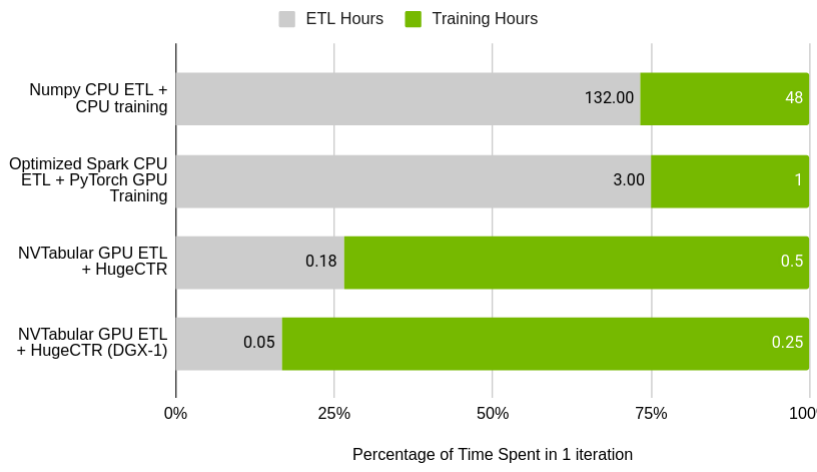

## NVTabular

NVTabular is a feature engineering and preprocessing library for tabular data designed to quickly and easily manipulate terabyte scale datasets used to train deep learning based recommender systems.  It provides a high level abstraction to simplify code and accelerates computation on the GPU using the [RAPIDS cuDF](https://github.com/rapidsai/cudf) library.

Recommender systems require massive datasets to train, particularly for deep learning based solutions.  The transformation of these datasets after ETL in order to prepare them for model training is particularly challenging.  Often the time taken to do steps such as feature engineering, categorical encoding and normalization of continuous variables exceeds the time it takes to train a model.

NVTabular is designed to support Data Scientists and ML Engineers trying to train (deep learning) recommender systems or other tabular data problems by allowing them to:

* Prepare datasets quickly and easily in order to experiment more and train more models.
* Work with datasets that exceed GPU and CPU memory without having to worry about scale.
* Focus on what to do with the data, and not how to do it, using our abstraction at the operation level.

It is also meant to help ML/Ops Engineers deploying models into production by providing:

* Faster dataset transformation, allowing for production models to be trained more frequently and kept up to date helping improve responsiveness and model performance.
* Integration with model serving frameworks like NVidia’s Triton Inference Server to make model deployment easy.
* Statistical monitoring of the dataset for distributional shift and outlier detection during production training or inference.

The library is designed to be interoperable with both PyTorch and Tensorflow using batch data-loaders that we’ve developed as extensions of native framework code.  NVTabular provides the option to shuffle data during preprocessing, allowing the data-loader to load large contiguous chunks from files rather than individual elements.  This allows us to do per epoch shuffles orders of magnitude faster than a full shuffle of the dataset.  We have benchmarked our data-loader at 100x the baseline item by item PyTorch dataloader and 3x the Tensorflow batch data-loader, with several optimizations yet to come in that stack.

Extending beyond model training, we plan to provide integration with model serving frameworks like [NVidia’s Triton Inference Server](https://github.com/NVIDIA/tensorrt-inference-server), creating a clear path to production inference for these models and allowing the feature engineering and preprocessing steps performed on the data during training to be easily and automatically applied to incoming data during inference.

Our goal is faster iteration on massive tabular datasets, both for experimentation during training, and also for production model responsiveness.   

### Getting Started
NVTabular is available in the NVidia container repository at the following location, http://ngc.nvidia.com/catalog/containers/nvidia:nvtabular.

The following images are available from the registry with cudf and nvtabular already installed:

| Available Images | Description | Environment |
| ------ | ------ | ------ |
| <container-registry>/cuda10.2_py3.7 | cuda 10.2 toolkit and python 3.7 | base |
| <container-registry>/cuda10.2_py3.7_tf2.1.0 | cuda 10.2 toolkit, python 3.7 and tensorflow 2.1.0 | base |
| <container-registry>/cuda10.2_py3.7_torch1.5 | cuda 10.2 toolkit, python 3.7 and pytorch 1.5 | base |
| <container-registry>/cuda10.2_py3.7_torch1.5_tf2.1.0 | cuda 10.2 toolkit, python 3.7, pytorch 1.5 and tensorflow 2.1.0 | base |
| <container-registry>/cuda10.2_py3.6 | cuda 10.2 toolkit and python 3.6 | base |
| <container-registry>/cuda10.2_py3.6_tf2.1.0 | cuda 10.2 toolkit, python 3.6 and tensorflow 2.1.0 | base |
| <container-registry>/cuda10.2_py3.6_torch1.5 | cuda 10.2 toolkit, python 3.6 and pytorch 1.5 | base |
| <container-registry>/cuda10.2_py3.6_torch1.5_tf2.1.0 | cuda 10.2 toolkit, python 3.6, pytorch 1.5 and tensorflow 2.1.0 | base |


Once you have selected, the desired container from the table above, you can run the container using the following commands:
```
docker run --gpus all --rm -it -p 9999:8888 -p 9797:8787 -p 9796:8786 --ipc=host --cap-add SYS_PTRACE <container_image> /bin/bash
```
If you are running on a docker version < 19 please change --gpus all to --runtime=nvidia.

The container will open a shell when the run command completes execution, you will be responsible for starting the jupyter lab on the docker container.
Should look similar to below:
```
root@2efa5b50b909: 
```

First, activate the correct environment:
```
root@2efa5b50b909: source activate base
```
Then you should see the following prompt (The environment has been activated):
```
(base)root@2efa5b50b909: 
```

Within the container is the codebase, along with all of our dependencies, particularly [RAPIDS cuDF](https://github.com/rapidsai/cudf), and a range of [examples](./examples).  The easiest way to get started is to simply launch the container above and explore the examples within.  It is designed to work with Cuda 10.2.  As we mature more cuda versions will be supported.

The code base with examples, can be found at the following directory location within the container:
```
/nvtabular/
```


```
conda install -c nvidia nvtabular
```

If you wish to install the library yourself you can do so using the commands above.  The requirements for the library include:

```
Requirements.yml
```

### Examples and Tutorials

An example demonstrating how to use NVTabular to preprocess the [Criteo 1TB dataset](https://labs.criteo.com/2014/02/kaggle-display-advertising-challenge-dataset/) can be found in the [criteo example notebook](examples/criteo-example.ipynb). This example also shows how to use NVTabular's data-loaders on the preprocessed data to train Facebook's [Deep Learning Recommender Model (DLRM)](https://github.com/facebookresearch/dlrm/).
Performance of the Criteo DRLM workflow demonstrates the effectiveness of the NVTabular library.  The original ETL script provided in Numpy took over five days to complete.  Combined with CPU training the total iteration time is over one week.  By optimizing the ETL code in spark and running on a DGX-1 equivilent cluster we were able to bring that time down to three hours for ETL and one hour for training.

With NVTabular on a single V100 32GB GPU we are able to complete ETL in 15 minutes, and using a DGX-1 cluster of eight V100 GPUs we can accelerate ETL to 3 minutes.  Combined with [HugeCTR](http://www.github.com/nvidia/HugeCTR/) we can process the dataset and train the full model in only 18 minutes.  This fast iteration is the goal of NVTabular and the Merlin application framework.


When examining the relative time spent in ETL vs Training we see that with NVTabular data scientists and ML engineers no longer need to spend 75% of their time on ETL. 



We also have a [simple tutorial](examples/rossmann-store-sales-example.ipynb) that demonstrates similar functionality on a much smaller dataset, providing a pipeline for the [Rossman store sales dataset](https://www.kaggle.com/c/rossmann-store-sales) fed into a [fast.ai tabular data model](https://docs.fast.ai/tabular.html).  

### Contributing

If you wish to contribute to the library directly please see [Contributing.md](./CONTRIBUTING.md).  We are in particular interested in contributions or feature requests for feature engineering or preprocessing operations that you have found helpful in your own workflows.

To be clear, this is an early alpha release, and we have a long way to go.  We have a working framework, but our [operator set](./Operators.md) is limited for the initial launch and every day we’re developing new optimizations that will help improve the performance of the library.  If you’re interested in working with us to help develop this library we’re looking for early collaborators and contributors.  In the coming months we’ll be optimizing existing operations, adding a full set of common feature engineering and preprocessing operations, and extending our backend to support multi-node and multi-gpu systems.  Please reach out via email or see our guide on contributions.  We are particularly interested in contributions or feature requests for feature engineering or preprocessing operations that you have found helpful in your own workflows.

### Learn More

If you’re interested in learning more about how NVTabular works under the hood we have provided this [more detailed description of the core functionality](HowItWorks.md).

We also have [API documentation](https://nvidia.github.io/NVTabular) that outlines in detail the specifics of the calls available within the library.
