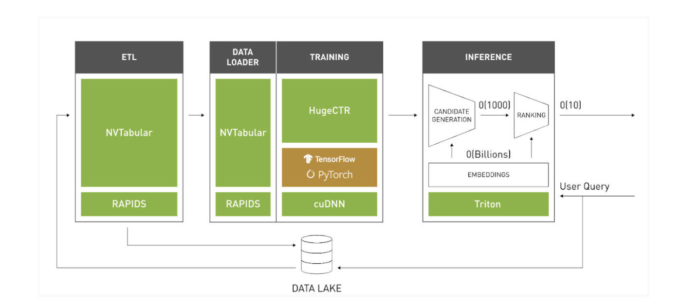

# Merlin Inference API

NVIDIA Merlin framework accelerates the recommendation pipeline end-2-end. As critical step of this pipeline, model deployment of machine learning (ML)/deep learning (DL) models is the process of making production ready models available in production environments, where they can provide predictions for new data.

Merlin Inference API is designed for a seamless integration between NVTabular and Triton Inference Server (IS), where Triton simplifies the deployment of AI models at scale in production. This integration makes online data transformation and generation of the query results for new data pretty easy. Users use `NVTabular` to preprocess training data and collect statistics (in our example for categorical features) at the training phase on training data. After this transformation and fit process, NVTabular’s workflow object is serialized to be loaded at inference phase to transform the new dataset with the collected statistics. By deserializing the saved NVTabular workflow, these statistics are applied to transform the new dataset at inference phase: whenever a new query is received by the inference server, the data is first fed into NVTabular to call the transform of the NVTabular workflow object. The output is then passed to the ML/DL model (a Tensorflow model in our example) and prediction results for the query are generated accordingly.

## Getting Started 

Under this directory, we provide six example notebooks: 

- [movielens-TF](https://github.com/NVIDIA/NVTabular/tree/main/examples/inference_triton/inference-TF/movielens-TF.ipynb)  
- [movielens-inference](https://github.com/NVIDIA/NVTabular/tree/main/examples/inference_triton/inference-TF/movielens-inference.ipynb)
- [movielens-multihot-TF](https://github.com/NVIDIA/NVTabular/tree/main/examples/inference_triton/inference-TF/movielens-multihot-TF.ipynb)  
- [movielens-multihot-inference](https://github.com/NVIDIA/NVTabular/tree/main/examples/inference_triton/inference-TF/movielens-multihot-inference.ipynb)
- [movielens-HugeCTR](https://github.com/NVIDIA/NVTabular/tree/main/examples/inference_triton/inference-HugeCTR/movielens-HugeCTR.ipynb)
- [movielens-HugeCTR-inference](https://github.com/NVIDIA/NVTabular/tree/main/examples/inference_triton/inference-HugeCTR/movielens-HugeCTR-inference.ipynb) 

## Pulling the Merlin Docker Containers:

In order to run the example notebooks above with Merlin Inference API, there are three containers that the user needs:

- [Merlin-Tensorflow-Training](https://ngc.nvidia.com/containers/nvidia:merlin:merlin-tensorflow-training): This is for preprocessing with NVTabular and training a model with Tensorflow framework. 
- [Merlin-Training](https://ngc.nvidia.com/containers/nvidia:merlin:merlin-training): This is for preprocessing with NVTabular and training a model with HugeCTR framework. 
- [Merlin-Inference](https://ngc.nvidia.com/containers/nvidia:merlin:merlin-inference): This is to launch Triton Inference Server and perform inference.

All the details about building and launching the containers are given in the README files under the `inference-TF` and `inference-HugeCTR` folders.
