# Accelerating TensorFlow Tabular Workflows with NVTabular
## Build container
First, build NVTabular container image from root directory
```
docker build -t $USER/nvtabular -f Dockerfile.nvtab .
```
Then build examples image on top of it
```
docker build -t $USER/nvtabular:examples -f Dockerfile.examples.nightly.root --build-arg base=$USER/nvtabular .
```
Now run container
```
docker run --rm -it -v /path/to/data:/data -p 8888:8888 -p 6006:6006 --gpus 1 $USER/nvtabular:examples
```
And navigate to `<your ip address>:8888/?token=nvidia`

## Perf Comparisons
### High level summary
<table>
  <tr>
    <td>GPU Native</td>
    <td>GPU Accelerated</td>
    <td>GPU Accelerated Mixed Precision</td>
  </tr>
  <tr>
    <td>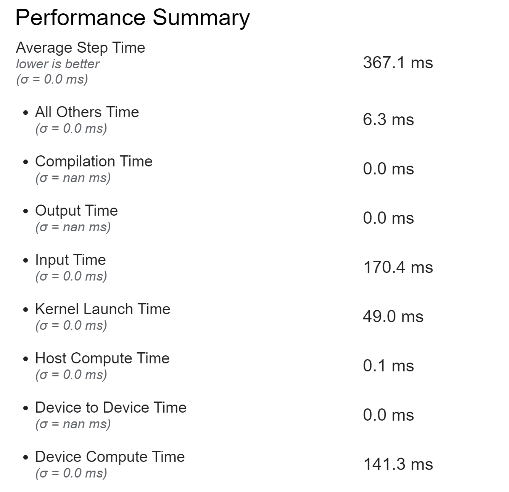</td>
    <td>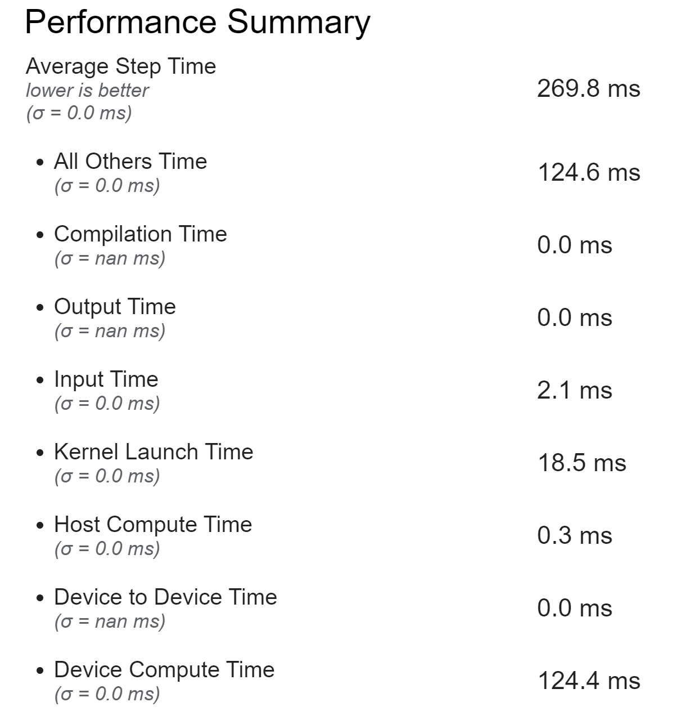</td>
    <td>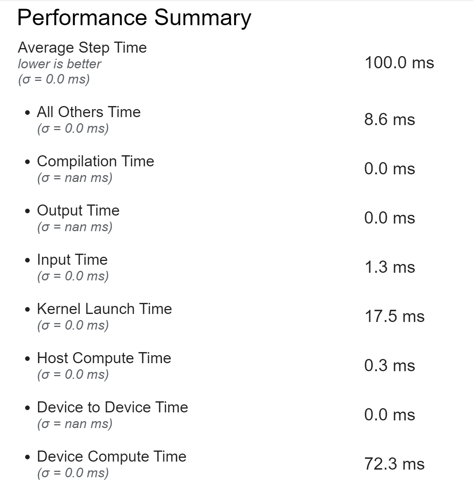</td>
  </tr>
</table>

### Device Kernel Time Divisions
<table>
  <tr>
    <td>GPU Native</td>
    <td>GPU Accelerated</td>
    <td>GPU Accelerated Mixed Precision</td>
  </tr>
  <tr>
    <td>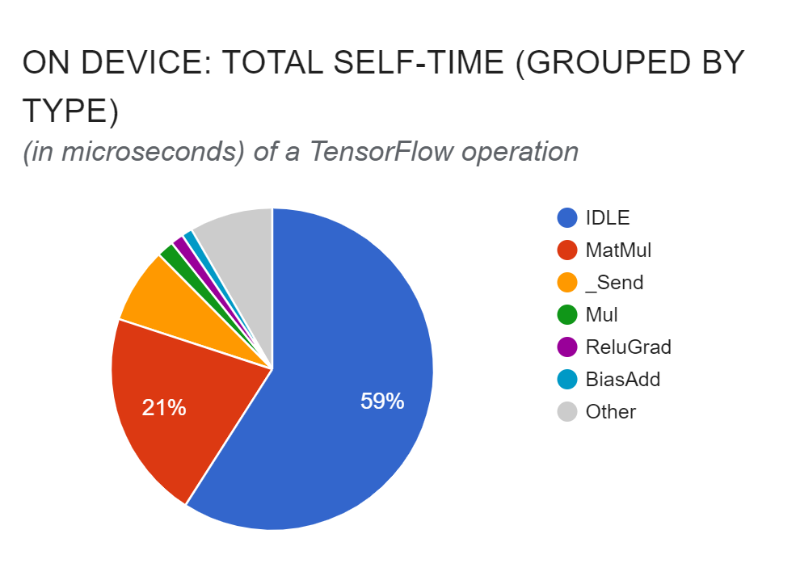</td>
    <td>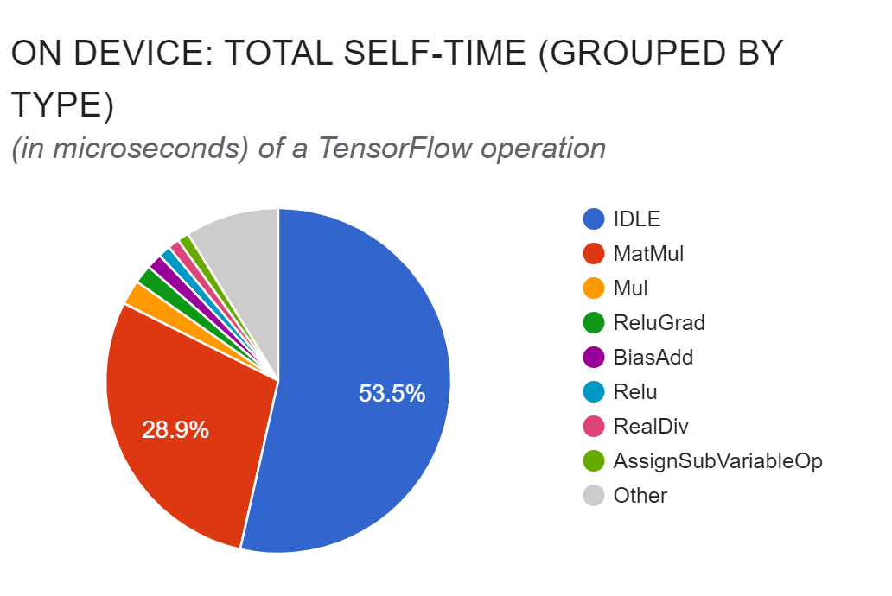</td>
    <td>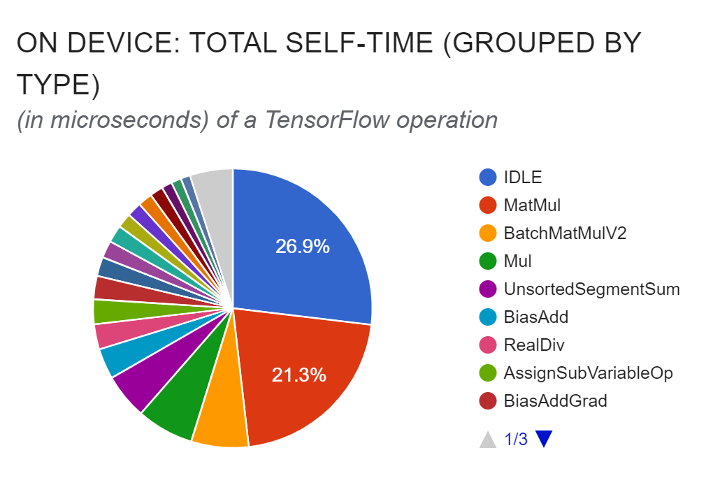</td>
  </tr>
</table>

### Trace Views
<table>
  <tr>
    <td>GPU Native</td>
    <td>GPU Accelerated</td>
    <td>GPU Accelerated Mixed Precision</td>
  </tr>
  <tr>
    <td>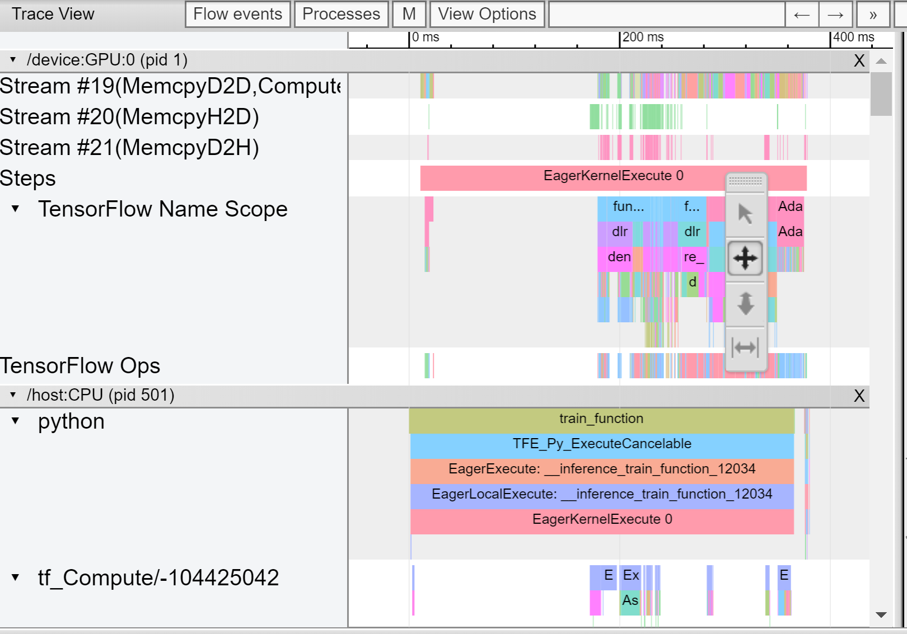</td>
    <td>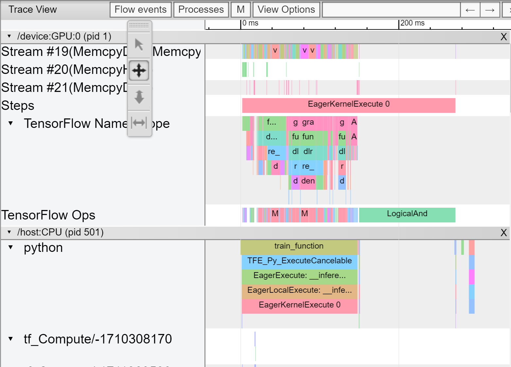</td>
    <td>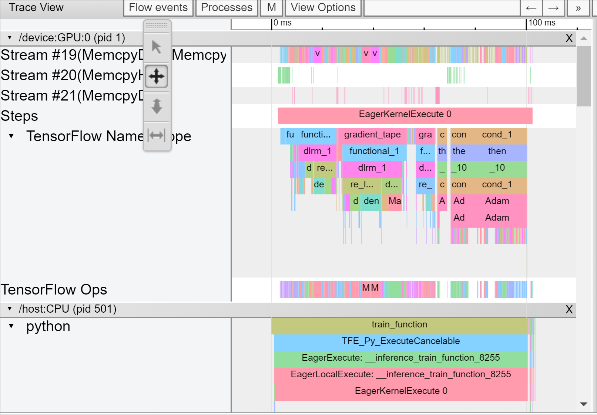</td>
  </tr>
</table>

Note the enormous amount of empty device time on the GPU native implementation. Let's zoom in on just the embedding section (where the GPU kernels start):
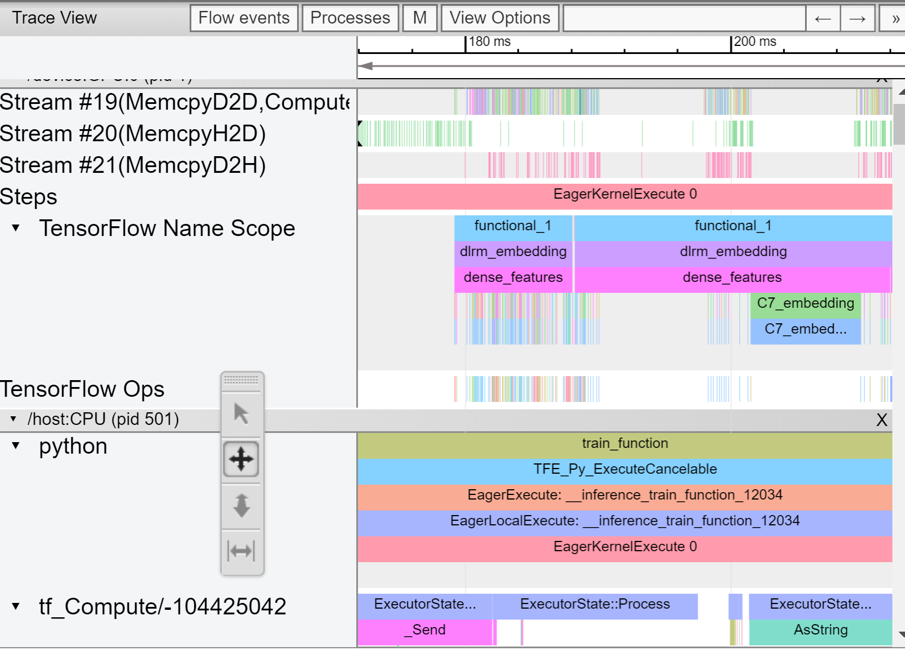</img>

### Example Throughput Curves (Mixed Precision not included yet)
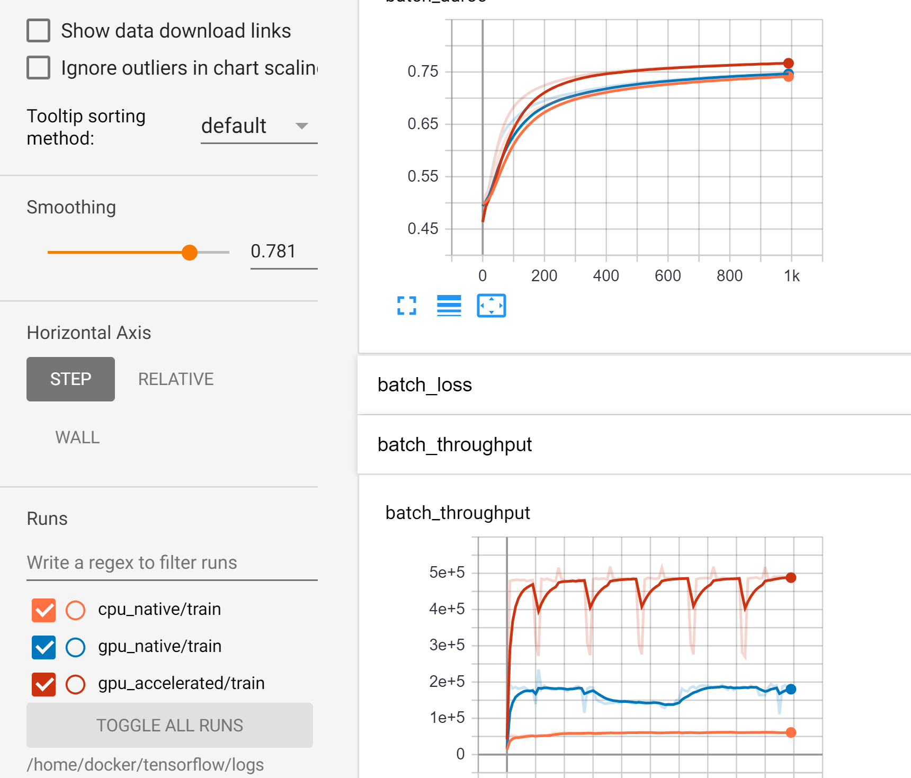</img>
